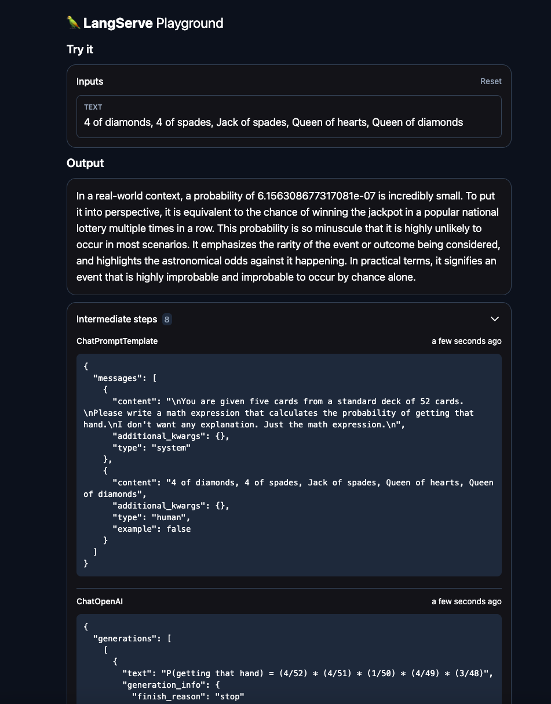

# LangChain helps the user understand the probability of a poker hand

This project is a LangChain prompt engineering application. ChatGPT receives a hand of cards by user input from a standard 52 card deck. Then it calculates the probability of that hand happening using the LangChain math LLM chain. Finally, it gives the user a paragraph explaining in real-world terms how small this probability is. This is an example of a prompting application with multiple layers.

## Main Features

1. **ChatPromptTemplate**: This class is used to create chat prompts for the AI.
2. **ChatOpenAI**: This class is used to handle the chat with OpenAI. It uses your OPENAI_API_KEY
3. **FastAPI Application**: The LangChain playground is served using FastAPI.
4. **Docker**: The application is build using docker compose.

## Issues

1. It doesn't calculate the probability correctly sometimes. That can be fixed with better prompting.
2. It doesn't validate user input. Also can be fixed with better prompting.
3. The paragraph it generates could have been more specific.
4. The math LLM chain is probably redundant? Maybe? Why would it exist then? More testing required.

## How to Run

1. Clone the repository.
2. Make .env file with OPENAI_API_KEY set to your open API key
3. Run `docker-compose up --build`
4. Go to `http://0.0.0.0:8000/test/playground/`

## Picture

## License

[MIT](https://choosealicense.com/licenses/mit/)
